# API Testing Demo – FastAPI Task Management API (DB-Backed)

This document records manual testing of the **PostgreSQL-backed FastAPI Task API** using Swagger UI (`http://127.0.0.1:8000/docs`).  
All tests were run locally to verify CRUD, filters, validation, and error handling.

---

## Overview

| Category | Description |
|:--|:--|
| **Framework** | FastAPI |
| **Environment** | Local (`uvicorn main:app --reload`) |
| **Database** | PostgreSQL (`task_api`) via SQLAlchemy |
| **Migrations** | Alembic (applied: `alembic upgrade head`) |
| **Key Endpoints** | `/todos/`, `/todos/{id}`, `/users/`, `/tags/` |
| **Filters** | `status`, `assignee_id`, `tag_id` on `GET /todos/` |
| **Validation & Errors** | 400 (invalid enum / bad IDs), 404 (not found), 422 (invalid UUID) |
| **Screenshots** | From `assets/db_assets/` (requests + responses) |

---

## Test Setup

1. Start the API:
```bash
uvicorn main:app --reload
```
2. Opened Swagger UI at http://127.0.0.1:8000/docs


3.	Tested each endpoint sequentially with valid and invalid payloads.
4.	Recorded screenshots for each request and response.

## Functional Endpoints Tested
1. Create Task - POST /todos/
- Purpose: Create a new task linked to an existing user and tag.
- Expected Response: 01 Created with full task object including UUIDs, timestamps, and M2M relationships.
- Result: Passed - new tasks created successfully with valid relationships

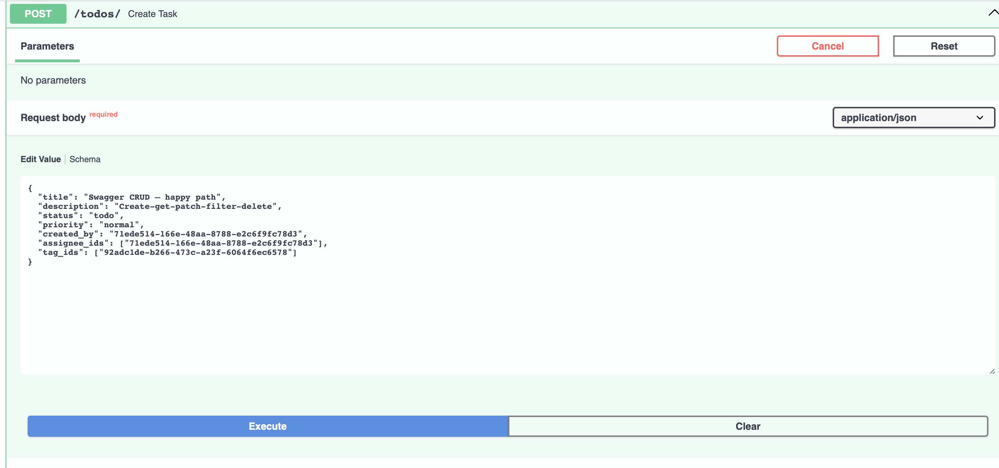


2. GET /todos/{id}
- Purpose: Retrieve a specific task by ID.
- Expected Response:
- 200 OK when found.
- 404 Not Found if ID doesn’t exist.
- Result: Passed - valid UUID returns full JSON task; invalid ID returns structured 404 error.

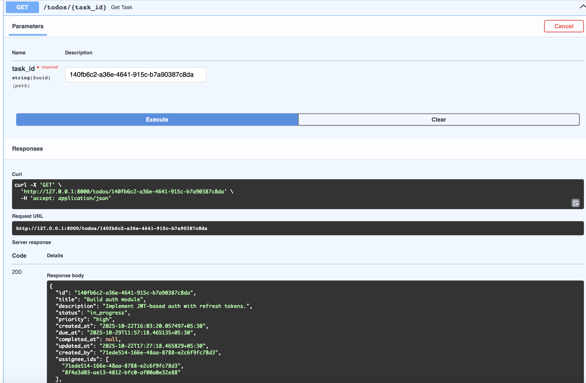

3. GET /todos/{Filters}
- Purpose: Retrieve tasks filtered by status, assignee, or tag.
- Expected Response:
- 200 OK with filtered list (possibly empty).
- Result: Passed - all filters return correct, narrowed-down results.

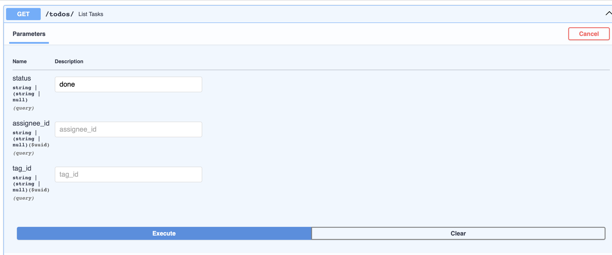
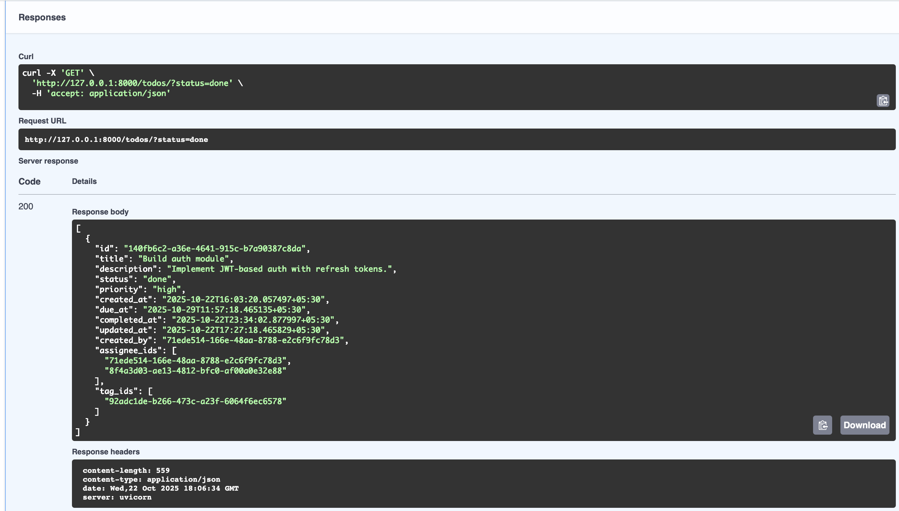


4. PATCH /todos/{id} (Status Update)
- Purpose: Partially update a task (e.g., change status to done).
- Expected Response:
- 200 OK with updated status.
- Automatically updates completed_at when status = done.
- Result: Passed - status successfully changed, completion timestamp auto-updated.

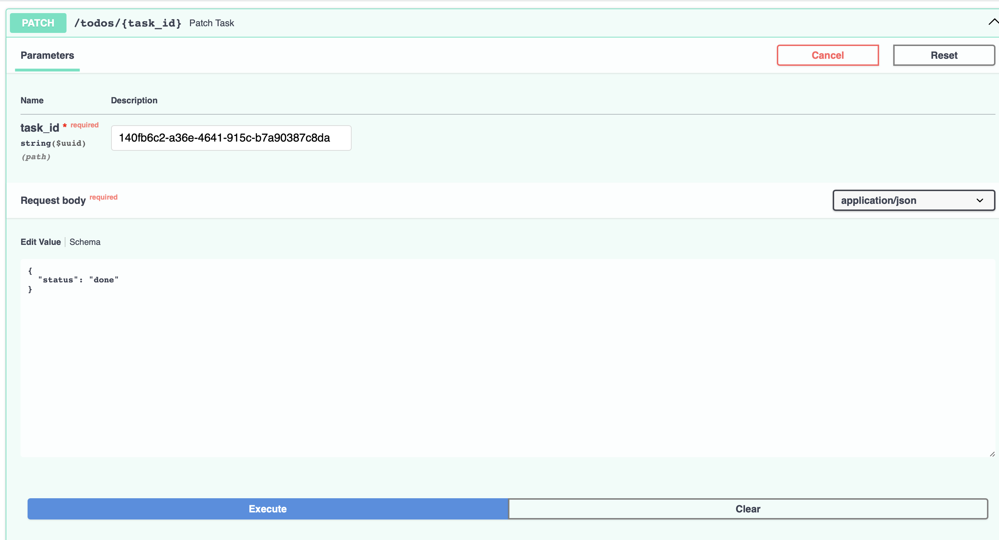
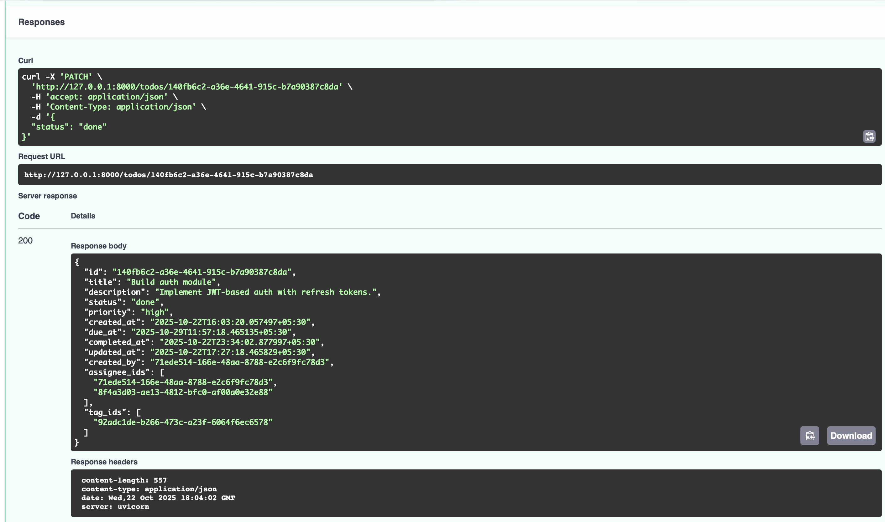

5. PATCH /todos/{id} (Clear M2M Relations)
- Purpose: Test clearing all assignees/tags using empty arrays.
- Expected Response:
- 200 OK and both assignee_ids and tag_ids returned as empty arrays.
- Result: Passed - confirmed that [] clears M2M links, while null would leave them unchanged.


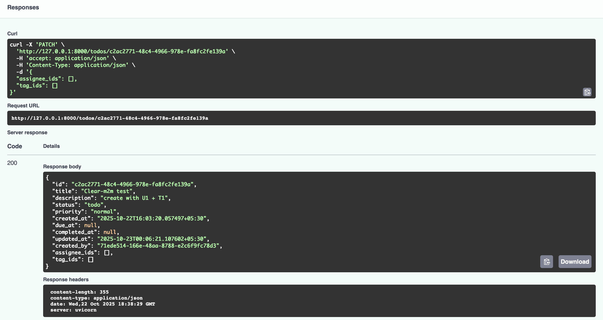

6. DELETE /todos/{id}
- Purpose: Delete a specific task by ID.
- Expected Response:
- First delete → 204 No Content.
- Second delete → 404 Not Found.
- Result: Passed - item deleted successfully; repeated call correctly triggers 404.

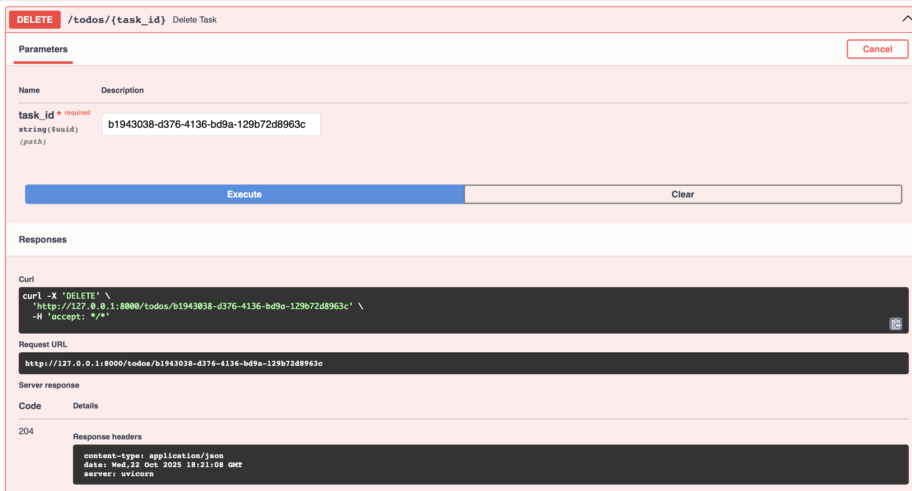


7. GET /users/
- Purpose: Verify users exist for linking to tasks.
- Expected Response: 200 OK with user list.
- Result: Passed - existing users (U1) returned as expected.

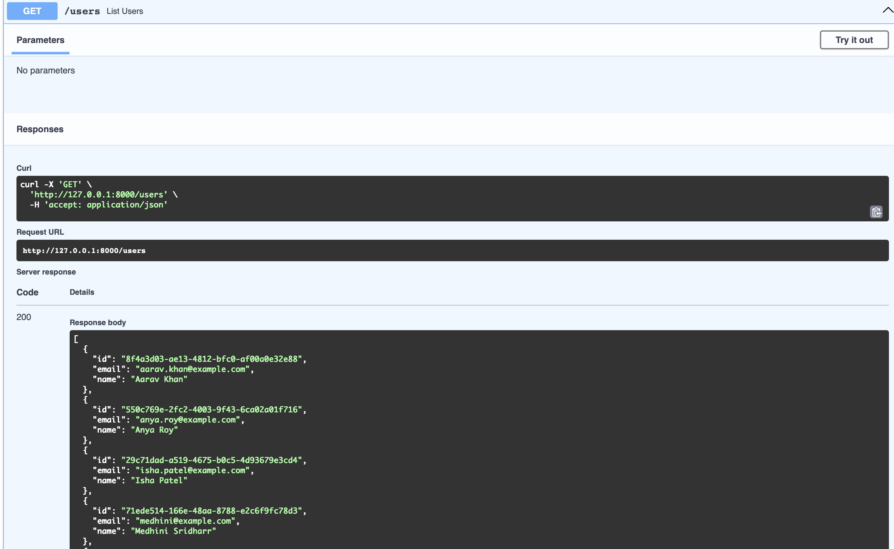

8. GET /tags/
- Purpose: Verify tags exist for linking to tasks.
- Expected Response: 200 OK with tag list.
- Result: Passed - existing tags (T1) returned successfully.

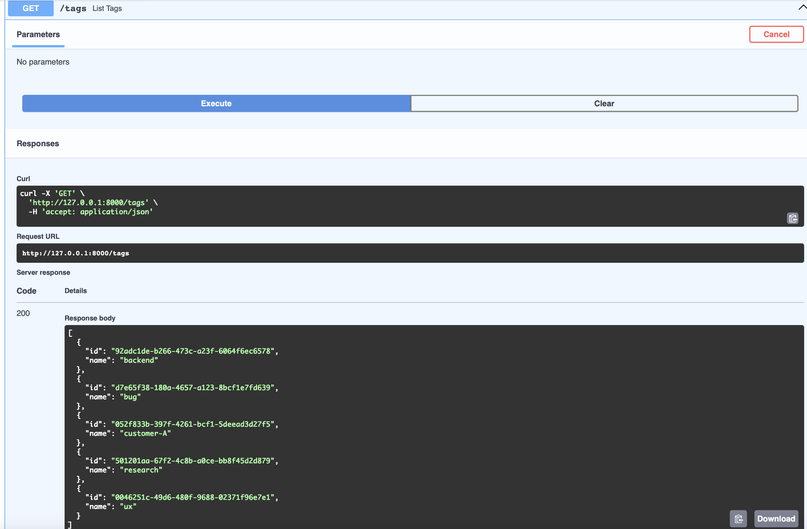

## Validation & Error Handling Tests
1. 400 – Invalid Status (POST)
- Scenario: Sent an invalid status enum during creation.
- Expected Response: { "error": "Invalid status" }
- Result: Passed - invalid enum caught and handled correctly.

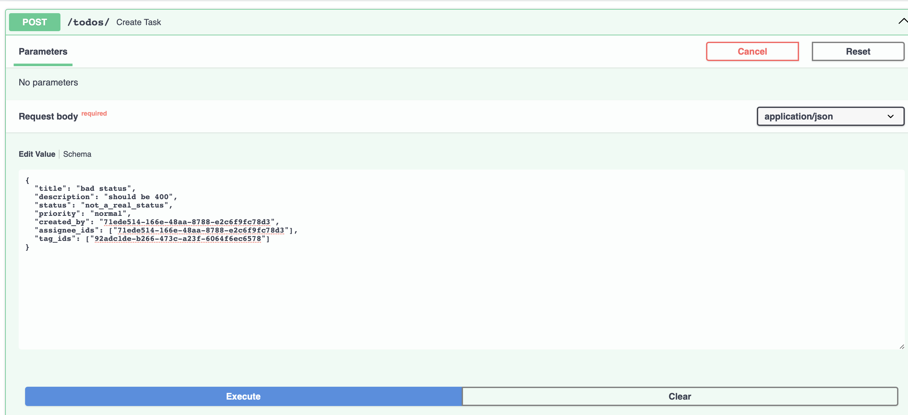
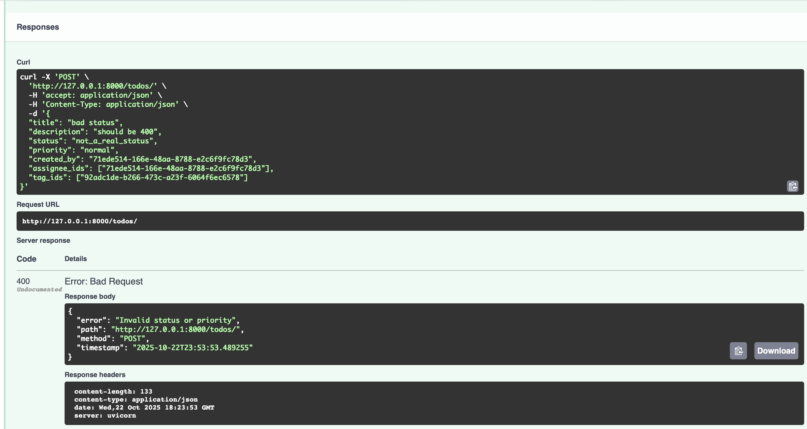

2. 400 – Invalid Status (PATCH)
- Scenario: Sent an invalid status enum on partial update.
- Expected Response: { "error": "Invalid status" }
- Result: Passed - invalid status blocked; descriptive error JSON returned.

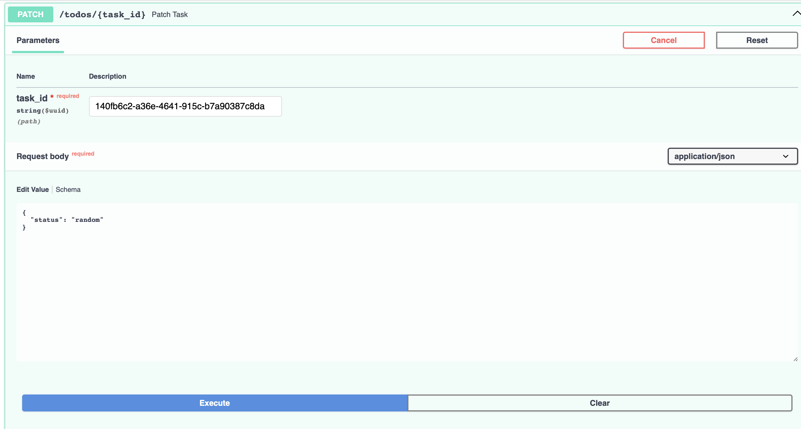
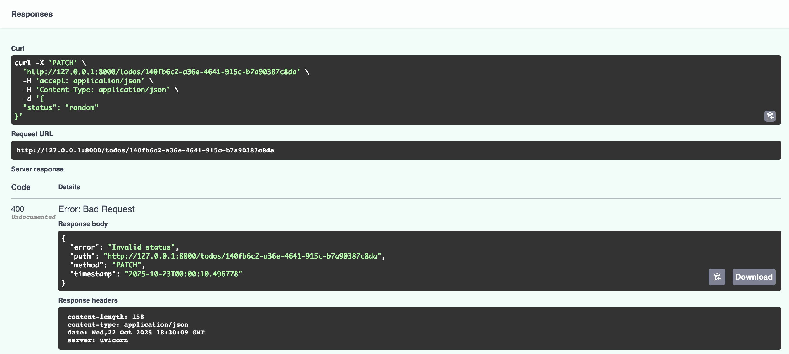

3. 400 – Invalid Assignee ID
- Scenario: Supplied invalid/nonexistent UUID in assignee_ids.
- Expected Response: { "error": "One or more assignee_ids are invalid" }
- Result: Passed - invalid assignee IDs correctly rejected.


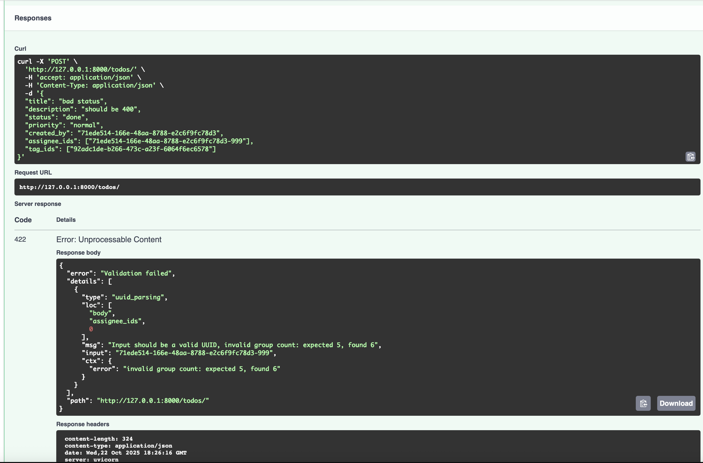

4. 400 – Invalid Tag ID
- Scenario: Supplied invalid/nonexistent UUID in tag_ids.
- Expected Response: { "error": "One or more tag_ids are invalid" }
- Result: Passed - invalid tag IDs correctly handled.

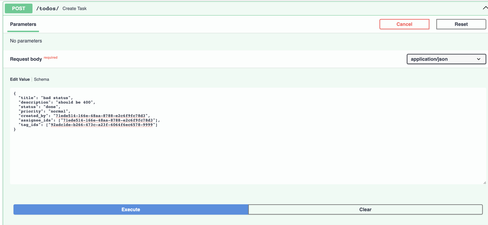
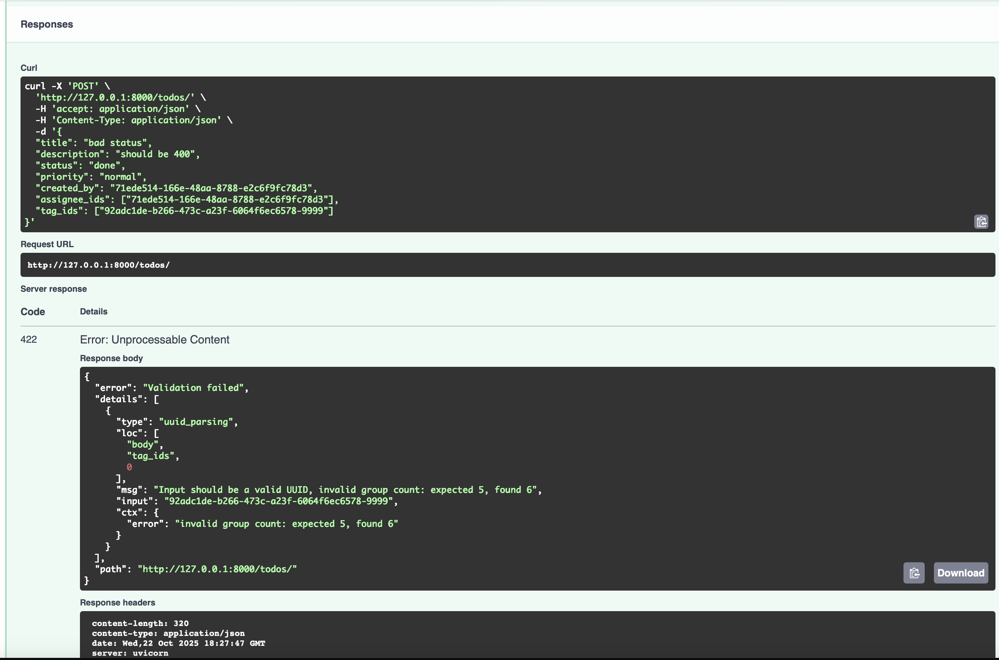


## Observations
- All CRUD endpoints behave as expected with consistent HTTP codes.
- Auto-handling of completed_at confirmed when status = done.
- M2M clearing ([]) vs. skipping (null) works exactly as designed.
- Validation and foreign key checks prevent bad data entry.
- Error responses are uniform (error, path, method, timestamp).
- Swagger UI reflects OpenAPI schema perfectly.

