# 🧪 API Testing Demo – FastAPI Todo App

This document records manual testing of the **FastAPI Task Management API** using the interactive Swagger UI (`http://127.0.0.1:8000/docs`).  
All tests were performed locally to verify request/response behavior, validation, and error handling.

---

## 🔍 Overview

| Category | Description |
|:----------|:-------------|
| **Framework** | FastAPI |
| **Environment** | Local (`uvicorn main:app --reload`) |
| **Endpoints Tested** | `GET /todos/`, `GET /todos/{id}`, `POST /todos/`, `PUT /todos/{id}`, `PATCH /todos/{id}`, `DELETE /todos/{id}` |
| **Validation & Errors** | 400 (blank title), 409 (duplicate title), 422 (invalid type), 404 (nonexistent ID) |
| **Testing Tool** | Swagger UI “Try it out” feature |
| **Screenshots** | 16 total (requests + responses, including patch error + fix) |

---

## ⚙️ Test Setup

1. Started the API locally:
```bash
   uvicorn main:app --reload
```
2. Opened Swagger UI at http://127.0.0.1:8000/docs

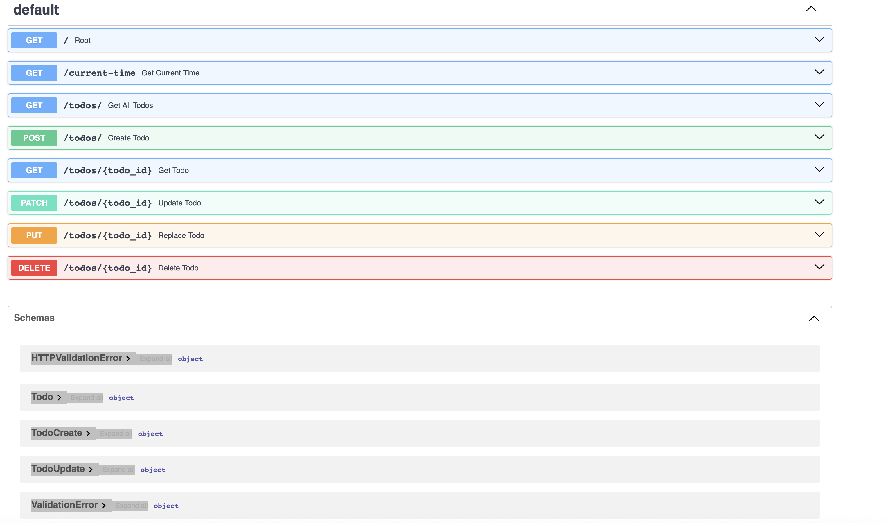

3.	Tested each endpoint sequentially with valid and invalid payloads.
4.	Recorded screenshots for each request and response.

## Functional Endpoints Tested
1. GET /todos/
- Purpose: Retrieve all existing tasks.
- Expected Response: 200 OK with a list of todos.
- Result: Passed - returns all seeded + newly created todos.

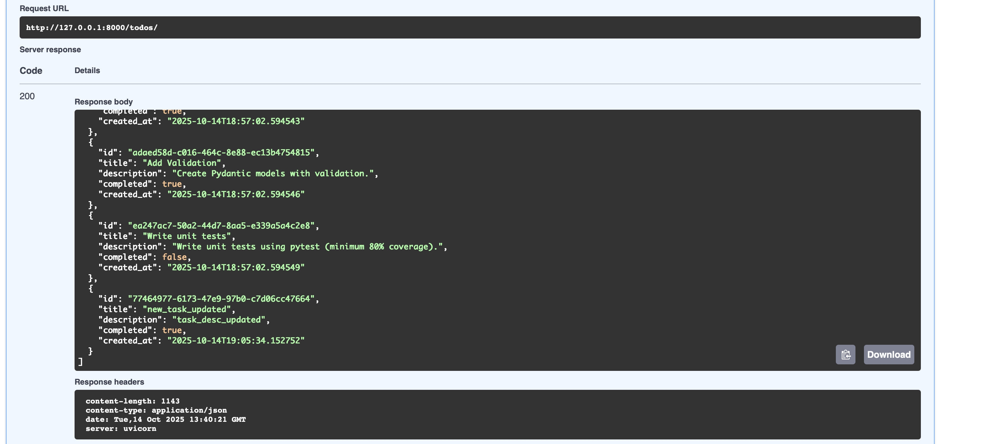

2. POST /todos/
- Purpose: Create a new todo.
- Payload Example:
```json
{
  "title": "Updated Full Todo",
  "description": "Replaced description",
  "completed": true
}
```
- Expected Response: 201 Created with full todo object.
- Result: Passed — new todos created successfully.

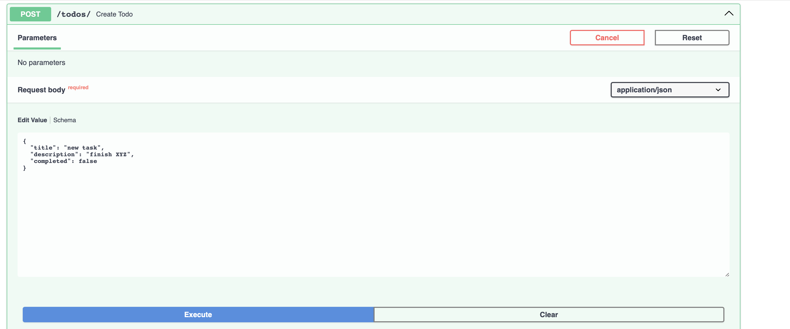
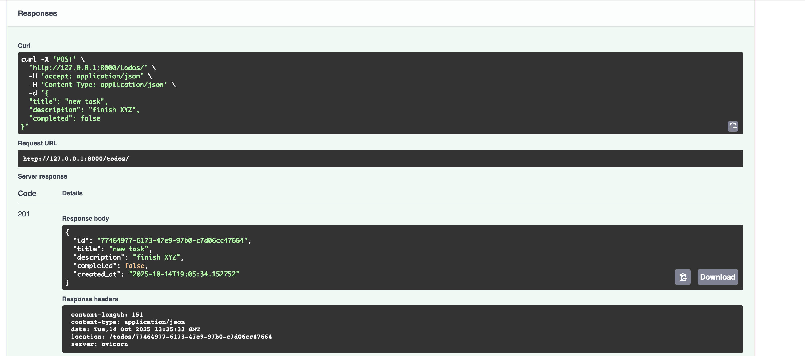

3. GET /todos/{id}
- Purpose: Retrieve a specific task by ID.
- Expected Response:
- 200 OK when found.
- 404 Not Found if ID doesn’t exist.
- Result: Passed - valid ID fetches the todo; invalid ID triggers error JSON.

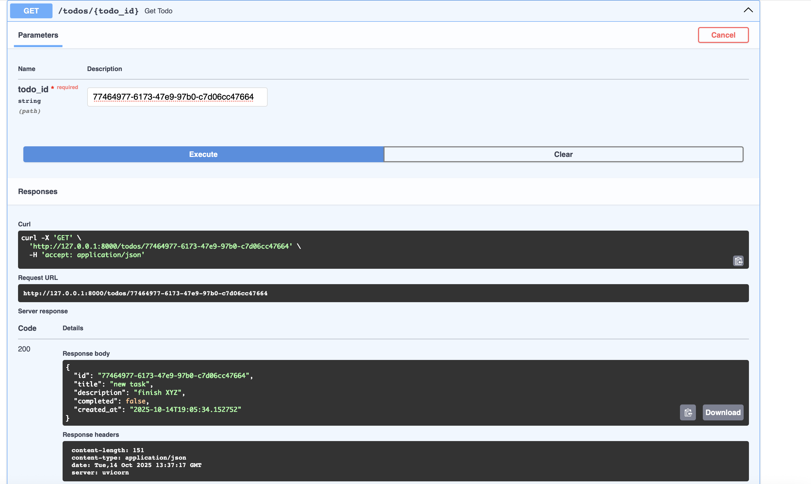

4. PUT /todos/{id}
- Purpose: Replace an existing todo completely.
- Payload Example:
```json
{
  "title": "Updated Full Todo",
  "description": "Replaced description",
  "completed": true
}
```
- Expected Response: 200 OK with updated todo data.
- Result: Passed - verified old fields replaced with new ones.

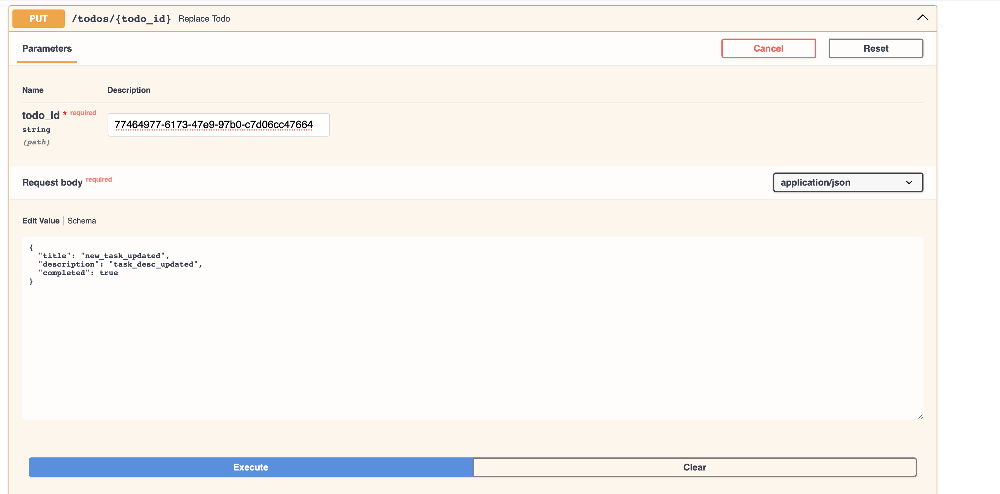
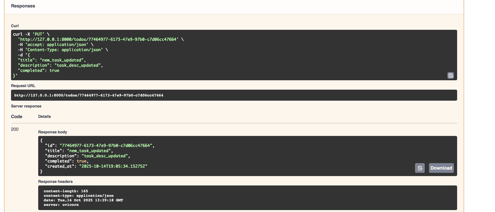

5. PATCH /todos/{id}
- Purpose: Partially update a todo (e.g., mark as completed).
- Payload Example:
```json
{ "completed": true }
```
- Expected Response: 200 OK when successful.
- Notes: Initially caused a validation error (see error section), later fixed.
- Result: Passed after correction - partial updates now work.

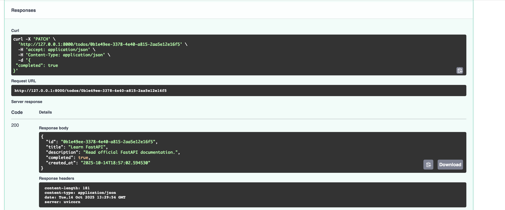

6. DELETE /todos/{id}
- Purpose: Delete a specific todo by ID.
- Expected Response:
- 204 No Content when deleted.
- 404 Not Found if called again for same ID.
- Result: Passed - first delete removes item, second returns 404 (see error section).

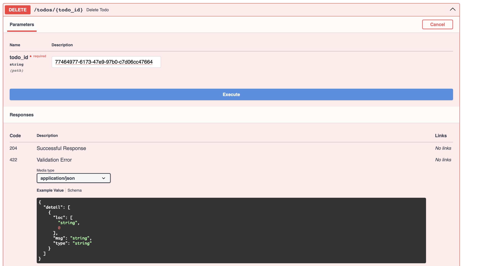


## Validation & Error Handling Tests
1. 400 Bad Request
- Scenario: Tried creating a todo with a blank title.
- Expected: { "error": "Title cannot be empty." }
- Result: Handled correctly.

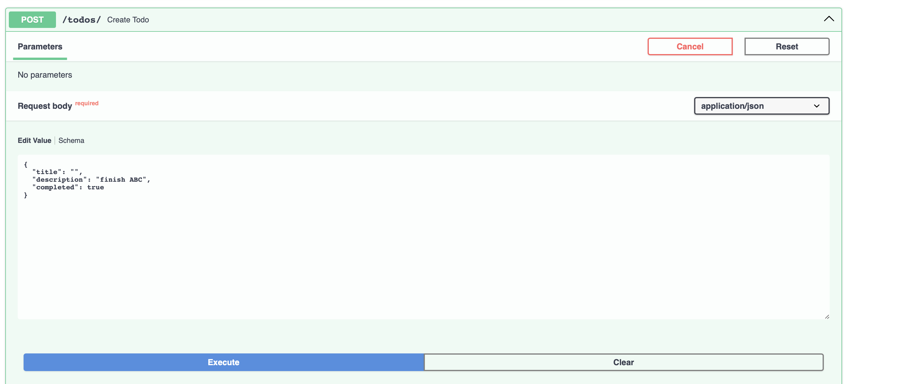
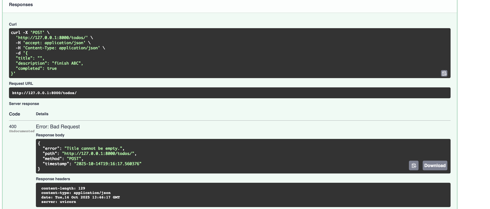

2. 409 Conflict
- Scenario: Attempted to create a todo with an existing title.
- Expected: { "error": "Task with this title already exists." }
- Result: Duplicate correctly blocked.

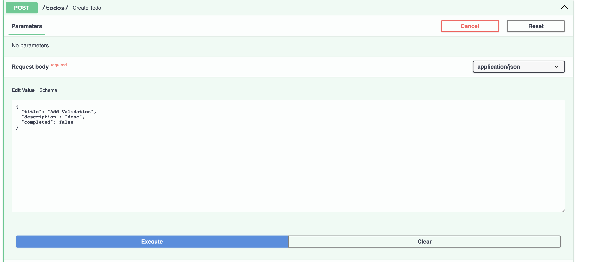
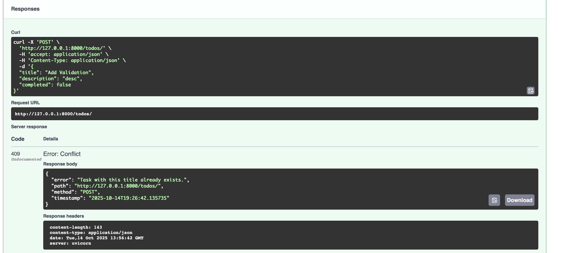

3. 422 Validation Error
- Scenario: Writing Optional[str] without a default still makes the field required (it just allows None as a value)
- Expected: { "error": "Validation failed" }
- Fix: Optional[str] = None - To make a field truly optional (i.e., may be omitted from the request), give it a default of None.
- Reason: 
    - With = None, FastAPI/Pydantic won’t complain when the field is missing from the body (e.g., { "completed": true }).
    - Without = None, the field is still required, and get “Field required” errors.

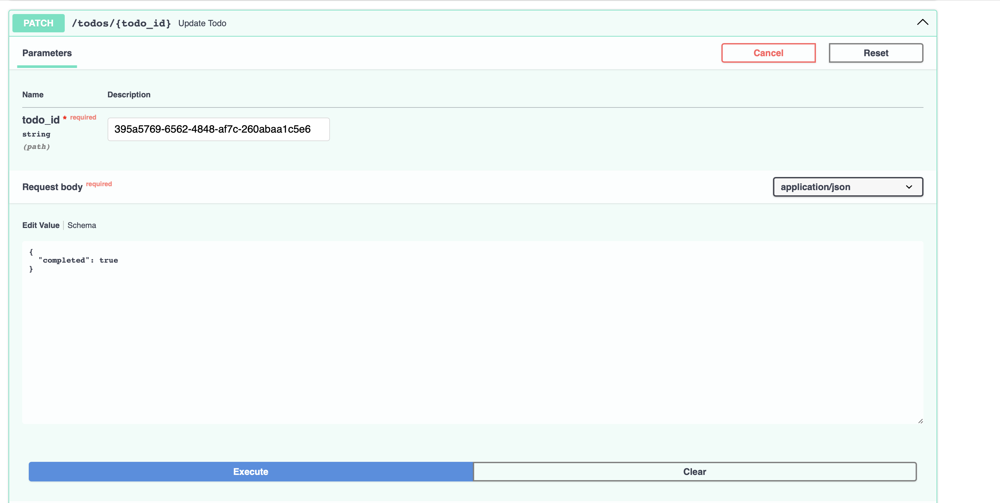
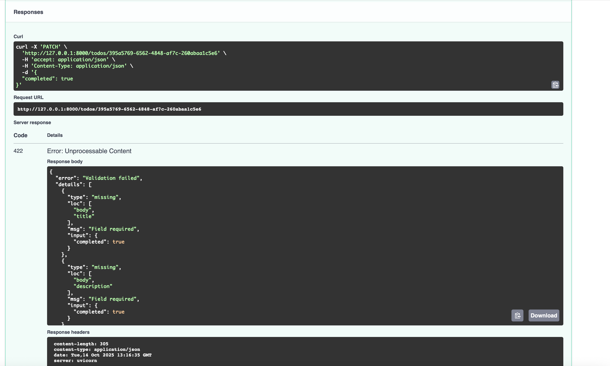

4. 404 Not Found
- Scenario: Tried to fetch or delete non-existent ID.
- Expected: { "error": "Task not found" }
- Result: Correctly returned structured JSON error.

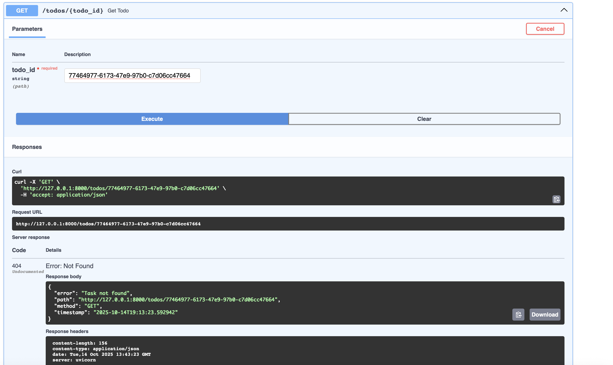

## Observations
- All CRUD endpoints behave as expected with correct HTTP status codes.
- Custom error handlers return clear, structured JSON with helpful details.
- Validation improvements (StrictBool, title checks) prevent silent coercion.
- Swagger UI interactions match the documented OpenAPI schema.

