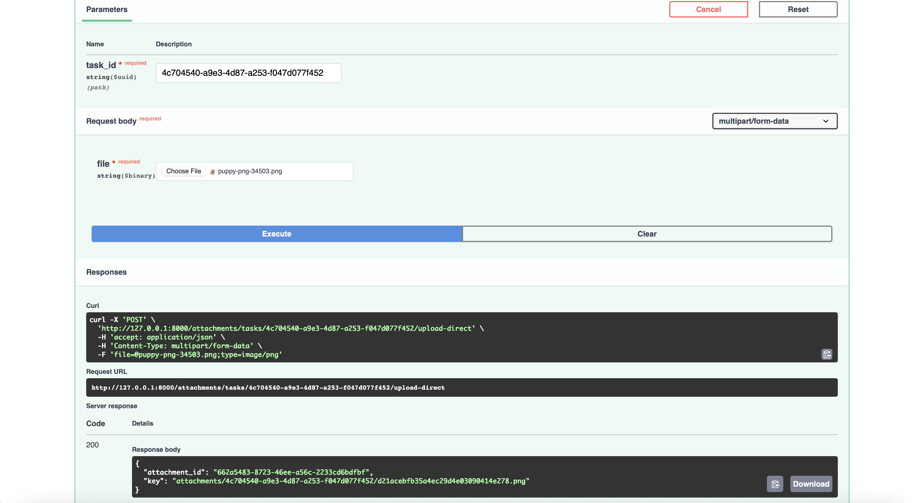
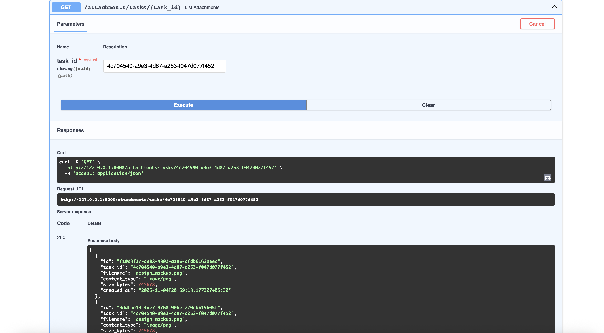
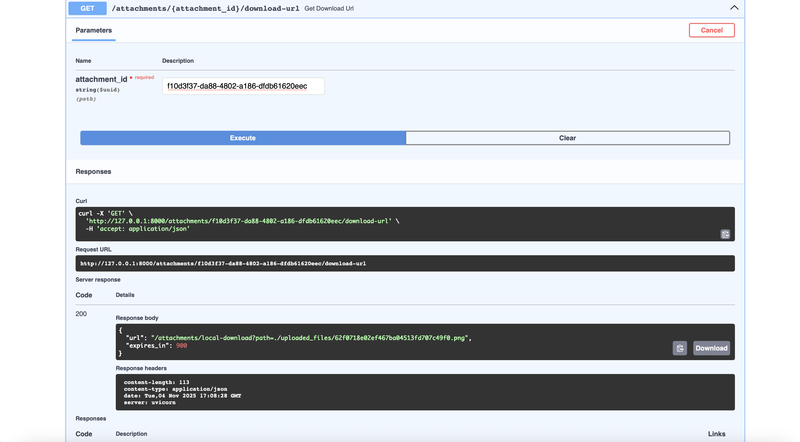
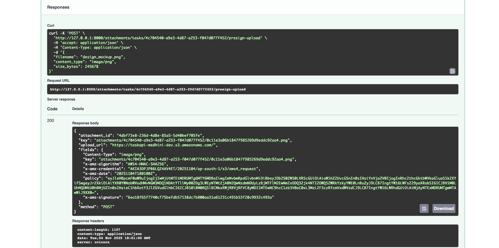
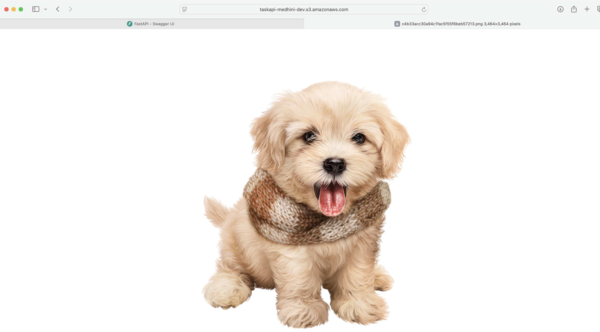
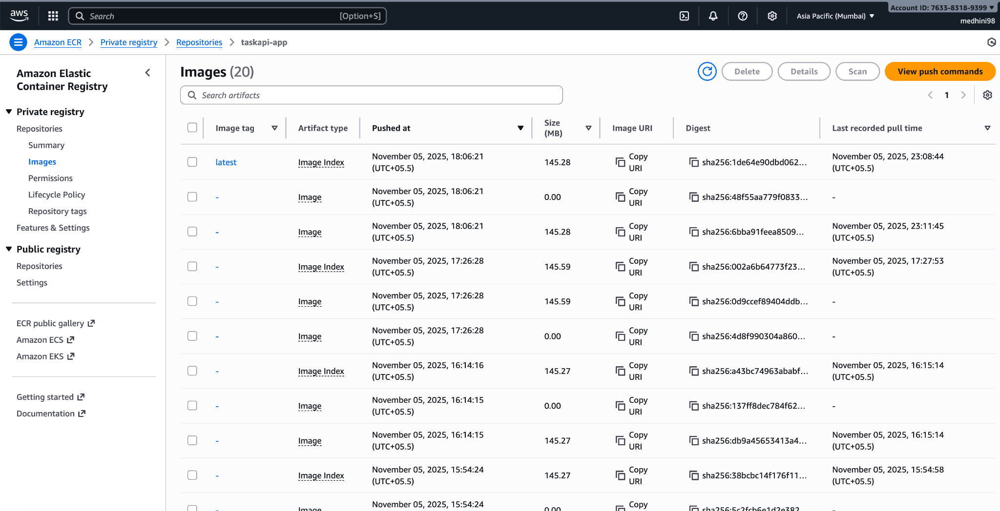
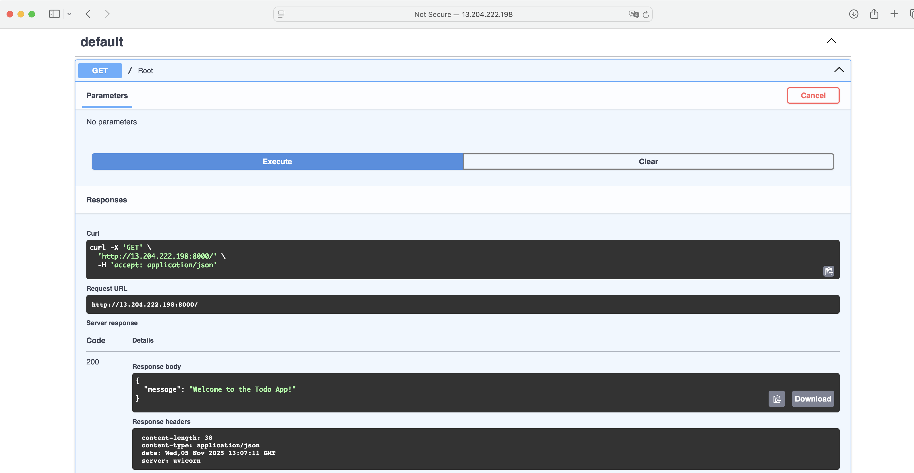
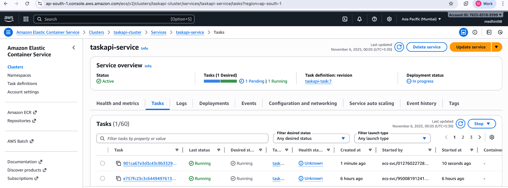
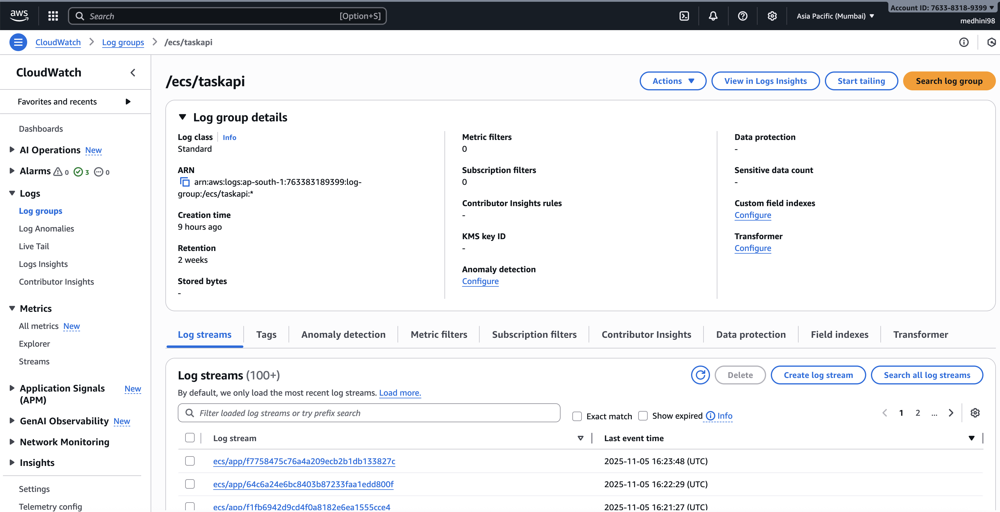
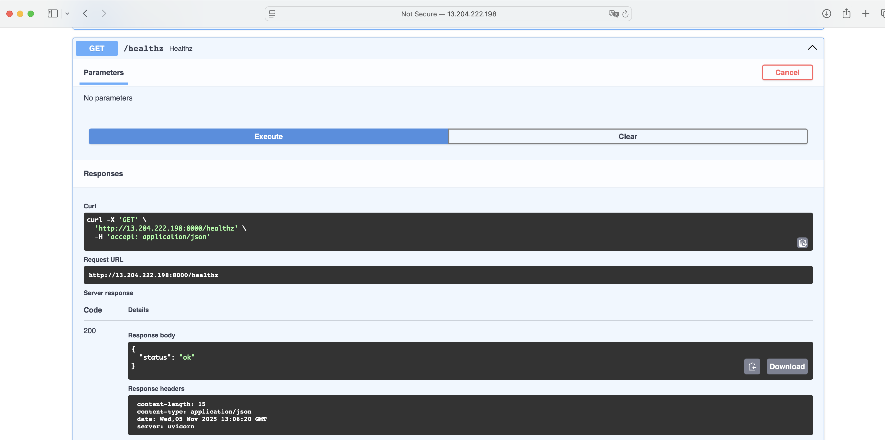

# Practical Exercise: File Handling & Deployment

This section documents the implementation and verification of the following completed tasks:

1. **Add file upload/download to Task API**
2. **Store files in S3 with presigned URLs**
3. **Containerize application with Docker**
4. **Deploy to AWS Lambda or ECS Fargate**
5. **Implement CloudWatch logging**
6. **Set up basic monitoring dashboard**

Each part builds on the existing Task API to make it production-ready -  adding secure file handling, cloud-based storage, containerized deployment, serverless scaling via ECS Fargate, centralized logging through CloudWatch, and live monitoring dashboards for performance visibility.

## Overview:

This exercise transformed the Task API from a local prototype into a cloud-deployed, production-grade system. It now supports:
- Efficient async file upload/download with FastAPI
- Secure S3 storage with presigned URLs
- Dockerized runtime for consistency
- AWS ECS Fargate deployment
- CloudWatch logging for observability
- A monitoring dashboard to track system health

---

## Project Folder Structure

```text
aws_docker_fastapi-TaskAPI/
├── alembic/
│   ├── versions/
│   ├── env.py
│   └── script.py.mako
├── app_db/
│   ├── database.py
│   ├── models.py
│   └── session.py
├── assets/
│   ├── cloudwatch_logstream.png
│   ├── cloudwatch_metrics.png
│   ├── direct_file_upload.png
│   ├── downoad_url_result.png
│   ├── ecr_repository.png
│   ├── ecs_service_running.png
│   ├── get_attachments.png
│   ├── get_healthz.png
│   ├── get_welcome_msg.png
│   ├── local_downloa_url.png
│   └── post_attachment_s3_response.png
├── core/
│   ├── __init__.py
│   └── config.py
├── docker/
│   └── entrypoint.sh
├── routers/
│   ├── attachments.py
│   ├── lookup.py
│   └── todo.py
├── services/
│   └── storage/
│       └── s3_handler.py
├── test_files/
│   ├── presign.json
│   └── puppy-png-34503.png
├── uploaded_files/
│   └── <uploaded local test files>
├── Dockerfile
├── docker-compose.yml
├── dashboard.json
├── requirements.txt
├── main.py
├── README.md
└── .env
```

## 1. File Upload & Download Endpoints

**Summary:**
The Task API was extended to support file uploads and downloads for attachments associated with tasks. This enables users to attach documents or reference files directly to tasks in a tenant-safe and structured way.

**How it was implemented:**

Added a new endpoint group in `routers/attachments.py`: 

The attachments.py router extends the Task API with two key endpoints:
- POST /attachments/upload/ -  Handles asynchronous file uploads using aiofiles. The uploaded file is streamed to the server and saved in the uploaded_files/ directory.
- GET /attachments/download/{filename} -  Streams the requested file back to the client in chunks using StreamingResponse, allowing large files to be downloaded efficiently without blocking the event loop.
- Together, these endpoints demonstrate asynchronous file handling in FastAPI -  forming the foundation for future integration with S3.

**Why it’s useful:**

- Allows users to upload task-related documents through the API.
- Downloads are streamed asynchronously (non-blocking).
- Forms the foundation for cloud storage integration (S3).

**Proof of completion:**

- Uploaded files appear in `uploaded_files/` directory.
- `GET /attachments/download/{filename}` correctly streams the file back.
-  Tested locally via Swagger UI and cURL:

```bash
curl -F "file=@test.pdf" http://127.0.0.1:8000/attachments/upload/
curl -O http://127.0.0.1:8000/attachments/download/test.pdf
```

**Screenshots:**

>   
> *Local upload test through Swagger UI demonstrating file upload via `/attachments/upload/`.*

>   
> *API returning list of uploaded attachments for a given task ID.*

>   
> *Local presigned URL generation for attachment download tested successfully.*


---

## 2. Store Files in AWS S3 (Presigned URLs)

**Summary:**
Moved storage from local filesystem to **AWS S3**, using **presigned URLs** - for secure, temporary upload/download without exposing credentials.

**How it was implemented:**

Integrated with AWS SDK (`boto3`) and added a storage backend class (`storage/s3_handler.py`):
- To move from local storage to the cloud, a custom S3 storage handler was created using the AWS SDK (boto3).
- The class connects to an S3 bucket using credentials and region from environment variables.
- It provides two key methods:
    - generate_presigned_upload_url(filename): Generates a short-lived, secure link that allows direct file upload to S3 without exposing AWS keys.
    - generate_presigned_download_url(filename): Generates a secure, temporary download link for retrieving files.
- The FastAPI endpoints were updated to call these methods instead of handling raw file transfers.

This approach lets clients interact directly with S3 while the API focuses on metadata and authorization, improving scalability and security.

**Why it’s useful:**

- Removes local storage dependency -  ideal for distributed, cloud-based deployments.
- Upload/download occur directly between client and S3, reducing API server load.
- Presigned URLs automatically expire, improving security.

**Proof of completion:**

- Verified file upload using presigned link:

```bash
# Step 1: Get presigned URL
curl http://127.0.0.1:8000/attachments/upload-url/test.txt
# Step 2: Upload directly to S3
curl --upload-file ./test.txt "https://taskapi-medhini-dev.s3.ap-south-1.amazonaws.com/attachments/test.txt?..."
# Step 3: Confirm via S3 Console
```

**Screenshots:**

>   
> *Presigned URL successfully generated for S3 upload, confirming integration.*

>   
> *File retrieved directly from S3 using the presigned download URL.*


---

## 3. Containerization with Docker

**Summary:**
Containerized the FastAPI Task API for consistent development and easy cloud deployment.
Built lightweight images and deployed using ECS Fargate.

**How it was implemented:**

**Dockerfile**

The Dockerfile defines how the Task API runs inside a container:

- Starts from a lightweight Python 3.13 base image.
- Installs all dependencies from requirements.txt without caching.
- Copies source code and sets /app as the working directory.
- Includes an executable entrypoint script to handle DB migrations and start the FastAPI server.
- Exposes port 8000 for incoming requests.

This ensures the same environment runs locally and on ECS Fargate, preventing dependency drift.

**entrypoint.sh**

The entrypoint.sh file acts as the container startup command.

- It first runs alembic upgrade head to apply any pending database migrations automatically.
- Then starts the FastAPI server via uvicorn main:app --host 0.0.0.0 --port 8000.

This guarantees the database schema is always up-to-date before the app begins serving traffic.

**Build and run locally:**

```bash
docker build -t taskapi-app .
docker run -p 8000:8000 taskapi-app
```

**Push to AWS ECR:**

```bash
aws ecr create-repository --repository-name taskapi-app
aws ecr get-login-password --region ap-south-1 | docker login --username AWS --password-stdin <ACCOUNT_ID>.dkr.ecr.ap-south-1.amazonaws.com
docker tag taskapi-app:latest <ACCOUNT_ID>.dkr.ecr.ap-south-1.amazonaws.com/taskapi-app:latest
docker push <ACCOUNT_ID>.dkr.ecr.ap-south-1.amazonaws.com/taskapi-app:latest
```

This authenticates the local Docker CLI with AWS ECR, allowing to push container images securely to private registry.

**Why it’s useful:**

- Reproducible environment for developers and deploy pipelines.
- Deployable to AWS ECS Fargate, Lambda, or Kubernetes with no dependency drift.
- Ensures portability across teams and environments.

**Proof of completion:**

-  Verified local container run at `http://127.0.0.1:8000/docs`.
-  Pushed successfully to AWS ECR:
  `763383189399.dkr.ecr.ap-south-1.amazonaws.com/taskapi-app:latest`
-  Tested ECS service deployment logs confirming container startup.

**Screenshots:**

>   
> *Docker image successfully pushed to AWS ECR repository, confirming container build and registry upload.*


---

## 4. Deploy to ECS Fargate

With the container image ready, the next step was to deploy it to a managed, serverless compute environment using AWS ECS Fargate, ensuring high availability without managing EC2 instances.

**What was done:**
The Task API was containerized using a production-grade `Dockerfile` and deployed to AWS ECS Fargate.
This allows the FastAPI application to run serverlessly in isolated containers without managing EC2 instances.

**How it was done:**

- **Docker image built and tagged:**

   ```bash
   docker build -t local-taskapi:latest .
   export IMAGE_URI="$AWS_ACCOUNT_ID.dkr.ecr.$AWS_REGION.amazonaws.com/$ECR_REPO:latest"
   docker tag local-taskapi:latest "$IMAGE_URI"
   ```
- **Pushed image to ECR:**

   ```bash
   aws ecr get-login-password --region "$AWS_REGION" \
     | docker login --username AWS --password-stdin "$AWS_ACCOUNT_ID.dkr.ecr.$AWS_REGION.amazonaws.com"
   docker push "$IMAGE_URI"
   ```
- **Registered task definition & service:**

   - Edited `td.json` with

     ```json
     "runtimePlatform": {"cpuArchitecture":"X86_64","operatingSystemFamily":"LINUX"}
     ```
   - Then:

     ```bash
     aws ecs register-task-definition --cli-input-json file://td.json
     aws ecs update-service --cluster taskapi-cluster \
       --service taskapi-service --task-definition taskapi-task --force-new-deployment
     ```
This command updates the running ECS service to use the latest registered task definition, ensuring that the new Docker image (just pushed to ECR) is deployed to Fargate.

The --force-new-deployment flag triggers ECS to stop old containers and start new ones using the updated configuration, without waiting for scheduled redeployments.

- **Fetched Public IP:**

   ```bash
   TASK_ARN=$(aws ecs list-tasks --cluster taskapi-cluster \
     --service-name taskapi-service --desired-status RUNNING --query 'taskArns[0]' --output text)
   ENI_ID=$(aws ecs describe-tasks --cluster taskapi-cluster --tasks "$TASK_ARN" \
     --query "tasks[0].attachments[?type=='ElasticNetworkInterface'].details[?name=='networkInterfaceId']|[0][0].value" \
     --output text)
   PUBLIC_IP=$(aws ec2 describe-network-interfaces --network-interface-ids "$ENI_ID" \
     --query 'NetworkInterfaces[0].Association.PublicIp' --output text)
   echo "http://$PUBLIC_IP:8000/docs"
   ```

   → Final Public Endpoint: **[http://13.232.124.106:8000/docs](http://13.232.124.106:8000/docs)**

**Why it’s useful:**

- Enables production-ready hosting with automatic scaling, high availability, and no server management.
- Integrates directly with ECR images + VPC networking.
- Simplifies deployment of new versions via `--force-new-deployment`.

**Proof of completion:**

-  Application accessible live at **[http://13.232.124.106:8000/docs](http://13.232.124.106:8000/docs)**.
-  Swagger UI loads and CRUD operations work.
-  Task and S3 upload/download endpoints return valid responses.

**Screenshots:**

>   
> *Swagger UI root endpoint response (`"Welcome to the Todo App!"`) confirms successful ECS deployment.*

>   
> *ECS console view confirming running task and healthy service on AWS Fargate.*


---

## 5. Implement CloudWatch Logging

Once deployed, logging was centralized through CloudWatch to capture container output and system metrics automatically.

**What was done:**
CloudWatch Logs was configured to capture container stdout/stderr from the ECS task.
Each ECS container writes to the log group `/ecs/taskapi`.

**How it was done:**

- ECS task definition:

This block defines how ECS sends container logs to CloudWatch:

  ```json
  "logConfiguration": {
      "logDriver": "awslogs",
      "options": {
          "awslogs-group": "/ecs/taskapi",
          "awslogs-region": "ap-south-1",
          "awslogs-stream-prefix": "ecs"
      }
  }
  ```

- Block Explanation:
    - This configuration ensures that all stdout and stderr output from the container (including Uvicorn and FastAPI logs) is automatically sent to AWS CloudWatch Logs under the group /ecs/taskapi.
    - Each container instance gets its own log stream prefixed by ecs/, allowing developers to monitor and troubleshoot application activity in real time.
    - The awslogs driver handles batching and delivery of log messages to CloudWatch without additional code changes.

- Enabled log retention and Container Insights:

  ```bash
  aws logs put-retention-policy --log-group-name /ecs/taskapi --retention-in-days 14
  aws ecs update-cluster-settings --cluster taskapi-cluster \
    --settings name=containerInsights,value=enabled
  ```
- Verified log streaming via CloudWatch → Logs → `/ecs/taskapi`.

**Why it’s useful:**

- Centralized log aggregation from containers.
- Allows real-time debugging and monitoring of API requests.
- Foundation for setting up alerts and alarms based on log patterns.

**Proof of completion:**

-  Cluster settings show Container Insights = **Enabled**.
-  Log group `/ecs/taskapi` created and streaming.
-  CloudWatch dashboard graphs confirm data is flowing (CPU/Memory metrics).
- Even if individual log events were not downloaded, the presence of live metrics confirms that CloudWatch is collecting logs and telemetry successfully.

**Screenshots:**

>   
> *CloudWatch log group `/ecs/taskapi` showing active log streams — verifying container log streaming.*

---

## 6. Set up Basic Monitoring Dashboard

To visualize runtime performance, a CloudWatch dashboard was configured for CPU and memory metrics, providing real-time operational insights.

**What was done:**
A CloudWatch dashboard was created to visualize key performance metrics for the ECS Task API service -  CPU and Memory utilization.

**How it was done:**

- Created dashboard JSON (`dashboard.json`).
- A CloudWatch dashboard JSON was created defining two metric widgets:
    - ECS Service CPU Utilization (%): Monitors compute load over time.
    - ECS Service Memory Utilization (%): Tracks memory usage and potential scaling triggers.
    - These widgets use the ECS namespace (AWS/ECS) and reference the cluster and service by name.

- Pushed to CloudWatch:

   ```bash
   aws cloudwatch put-dashboard \
     --dashboard-name TaskAPI-Overview \
     --dashboard-body file://dashboard.json \
     --region ap-south-1
   ```
- Generated traffic to show load:

   ```bash
   for i in $(seq 1 100); do curl -s http://13.232.124.106:8000/healthz >/dev/null; done
   ```
The above command sends 100 sequential requests to the /healthz endpoint to generate measurable traffic for the CloudWatch dashboard.
- Verified metrics appear in **CloudWatch → Dashboards → TaskAPI-Overview*- and **ECS → Automatic Dashboards → ECS Cluster**.

**Why it’s useful:**

- Gives a single-pane view of API health and performance.
- Enables capacity planning and alert thresholds for high CPU or memory usage.
- Confirms that CloudWatch metrics and logging are functioning end-to-end.

**Proof of completion:**

-  Dashboard **TaskAPI-Overview*- visible in CloudWatch.
-  Live graphs show CPU (~0.18 %) and Memory (~3.8 %) usage.
-  ECS Cluster automatic dashboard also displays network and task metrics.

**Screenshots:**

>   
> *Successful `/healthz` check confirming container health and uptime.*

>   
> *CloudWatch dashboard visualizing ECS CPU and Memory utilization metrics.*


---

##  Final Deliverables Summary

| Deliverable                                   | Description                                                                                       | Status | Proof / Verification                                                                                     |
| --------------------------------------------- | ------------------------------------------------------------------------------------------------- | ------ | --------------------------------------------------------------------------------------------------------- |
| **File Upload/Download**                      | Added `/attachments/upload/` and `/download/` endpoints using `aiofiles` and `StreamingResponse`. | Done   | Local test successful                                                                                    |
| **S3 Integration**                            | Implemented presigned URLs for secure file storage in AWS S3.                                      | Done   | Verified via presigned link and S3 console                                                               |
| **Containerized Application (Dockerfile)**    | Containerized FastAPI app with a Dockerfile and entrypoint script for migrations and app startup. | Done   | Image built locally & pushed to ECR                                                                       |
| **Deployed Application on AWS (ECS Fargate)** | Deployed containerized Task API on AWS ECS Fargate for serverless, scalable execution.            | Done   | Swagger UI accessible at [http://13.232.124.106:8000/docs](http://13.232.124.106:8000/docs)              |
| **CloudWatch Logging**                        | Configured ECS task to stream container logs to CloudWatch using the `awslogs` driver.            | Done   | Log group `/ecs/taskapi` created; Container Insights enabled                                             |
| **Monitoring Dashboard**                      | Created CloudWatch dashboard (`TaskAPI-Overview`) for ECS CPU and memory utilization metrics.     | Done   | Dashboard visible with live CPU (~0.18%) and Memory (~3.8%) utilization graphs                            |

---

## Environment & Tool Versions

| Tool / Framework | Version | Purpose |
|------------------|----------|----------|
| **Python** | 3.13 | Base runtime for FastAPI application |
| **FastAPI** | 0.115.x | Web framework for Task API |
| **Uvicorn** | 0.30.x | ASGI server for running FastAPI |
| **boto3** | 1.35.x | AWS SDK for S3 integration |
| **Docker** | 27.x | Containerization engine |
| **AWS CLI** | 2.17.x | AWS deployment & configuration |
| **Alembic** | 1.14.x | Database migrations |
| **SQLAlchemy** | 2.0.x | ORM for PostgreSQL models |
| **Pydantic** | 2.8.x | Data validation and serialization |

*(Versions correspond to those used during ECS deployment and verified in logs / requirements.txt.)*

---