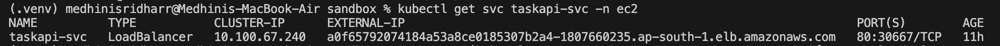
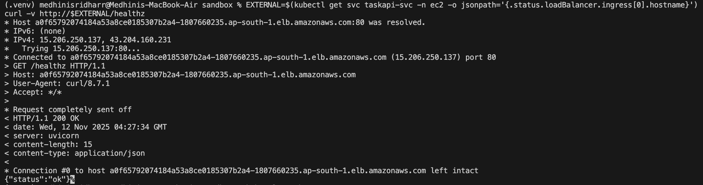
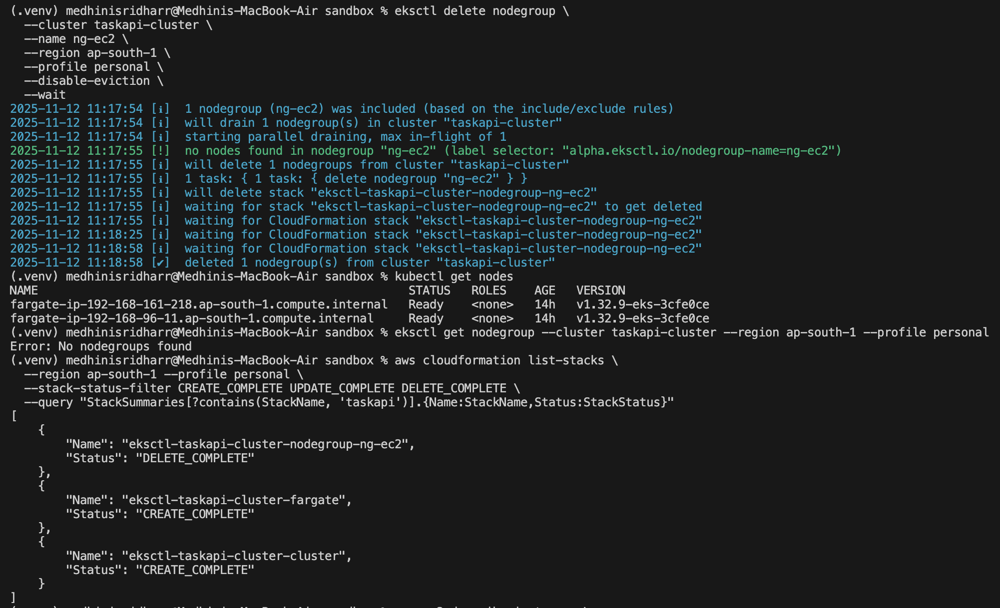
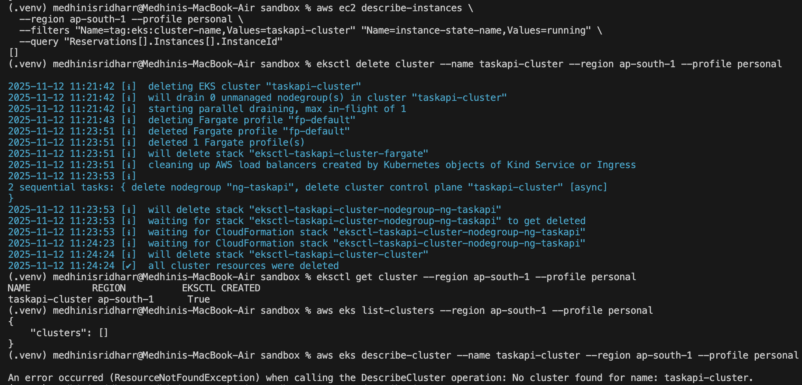

# Deploy to EKS

## Summary (TL;DR)
- AWS profile: personal (Region: ap-south-1, Account: 763383189399)
- Cluster: taskapi-cluster (created with eksctl)
- Compute:
- Fargate attempted first (for default namespace)
- Final working path: Managed EC2 node group + namespace ec2
- Image: 763383189399.dkr.ecr.ap-south-1.amazonaws.com/taskapi:amd64
- Kubernetes objects (namespace ec2):
- Deployment (2 replicas), Service (LoadBalancer), HPA (2–5, CPU 60%)
- Health checks: /healthz (readiness + liveness)
- Resources: requests 100m / 128Mi, limits 500m / 512Mi
- Public test: curl -v http://<LB-DNS>/healthz → {"status":"ok"}

---

## Why these choices
- Fargate first (serverless pods) to reduce node management.
- Hit infra-specific blockers for external LB on day one (classic in new VPCs).
- Fastest path to a public URL: add a tiny EC2 node group and deploy the app into a separate namespace (ec2).
- Classic/NLB instance-target LBs work out of the box in this mode.
- Kept Fargate for default namespace so future Ingress (ALB) path remains possible.

---

## Step-by-step Process
### 0) Prereqs
- awscli, kubectl, eksctl, docker
- Docker login to ECR with the personal profile.
```bash
export AWS_PROFILE=personal
export AWS_REGION=ap-south-1
aws sts get-caller-identity
```

### 1) Build & push image to ECR (multi-arch issue solved with amd64)

Local image was built on Apple Silicon (ARM) which failed on Fargate. Rebuilt & pushed linux/amd64:
```bash
ACCOUNT_ID=$(aws sts get-caller-identity --query Account --output text)
aws ecr get-login-password --region $AWS_REGION \
| docker login --username AWS --password-stdin $ACCOUNT_ID.dkr.ecr.$AWS_REGION.amazonaws.com

docker buildx create --use 2>/dev/null || true
docker buildx build --platform linux/amd64 \
  -t $ACCOUNT_ID.dkr.ecr.$AWS_REGION.amazonaws.com/taskapi:amd64 \
  --push .
  ```
Why: Fargate/EC2 AMIs in this cluster expect linux/amd64. The new tag guarantees compatibility.

### 2) Create EKS cluster
```bash
eksctl create cluster \
  --name taskapi-cluster \
  --region ap-south-1 \
  --nodegroup-name ng-taskapi \
  --nodes 2 \
  --node-type t3.medium \
  --managed \
  --profile personal
  ```
If creation times out on the nodegroup, re-check via:
```bash
aws eks describe-cluster --name taskapi-cluster --region ap-south-1 --profile personal --query 'cluster.status'
aws eks describe-nodegroup --cluster-name taskapi-cluster --nodegroup-name ng-taskapi --region ap-south-1 --profile personal --query 'nodegroup.status'
```

Update kubeconfig:
```bash
aws eks update-kubeconfig --name taskapi-cluster --region ap-south-1 --profile personal
kubectl get nodes
```

### 3) (Initially) Deploy on Fargate (hit image & LB issues)
- Fixed ECR pull by attaching AmazonEC2ContainerRegistryReadOnly to the Fargate pod execution role.
- Fixed image architecture by pushing :amd64.
- LB stayed pending/empty due to subnet/target-type constraints.

(This attempt is documented in “Errors & Fixes”; final deployment below uses EC2.)

### 4) Add a tiny EC2 node group (final path)
```bash
eksctl create nodegroup \
  --cluster taskapi-cluster \
  --region ap-south-1 \
  --name ng-ec2 \
  --nodes 1 \
  --node-type t3.small \
  --managed \
  --profile personal

aws eks describe-nodegroup \
  --cluster-name taskapi-cluster \
  --nodegroup-name ng-ec2 \
  --region ap-south-1 --profile personal \
  --query 'nodegroup.status'
kubectl get nodes
```

### 5) Create namespace for EC2 scheduling
```bash
kubectl create namespace ec2
```

### 6) Kubernetes manifests (in k8s/)
- deployment-ec2.yaml
- Image: .../taskapi:amd64
- Replicas: 2
- containerPort: 8000
- Probes: readiness & liveness at /healthz
- Resources: requests/limits as above
- Env: DATABASE_URL=sqlite:///./data.db
- service-ec2.yaml
- type: LoadBalancer, port 80 → targetPort 8000
- hpa-ec2.yaml
- min 2, max 5, CPU target 60%

Apply:
```bash
kubectl apply -f k8s/deployment-ec2.yaml
kubectl apply -f k8s/service-ec2.yaml
kubectl apply -f k8s/hpa-ec2.yaml

kubectl rollout status deploy/taskapi -n ec2
kubectl get pods -n ec2 -o wide
kubectl get svc taskapi-svc -n ec2 -w
```

Expected:
```bash
EXTERNAL-IP: a0f65792074184a53a8ce0185307b2a4-1807660235.ap-south-1.elb.amazonaws.com
```

### 7) Metrics + HPA verification
```bash
kubectl apply -f https://github.com/kubernetes-sigs/metrics-server/releases/latest/download/components.yaml
kubectl top pods -n ec2
kubectl get hpa -n ec2
```

Generate a small spike:
```bash
EXTERNAL=$(kubectl get svc taskapi-svc -n ec2 -o jsonpath='{.status.loadBalancer.ingress[0].hostname}')
for i in {1..200}; do curl -s http://$EXTERNAL/healthz > /dev/null & done; wait
kubectl top pods -n ec2
kubectl get hpa -n ec2
```

---

## Architecture
```text

                             +---------------------------+
                             |   Local System (Laptop)  |
                             |  curl / browser / CI/CD  |
                             +------------+--------------+
                                          |
                                          v
                               Public Internet (HTTP)
                                          |
                                          v
+----------------------+       +---------------------------+         +----------------------+
|  Amazon EKS Control  |<----->|  Elastic Load Balancer    |  --->   |  Amazon EC2 Node(s) |
|  Plane (managed)     |       |  (internet-facing, ELB)   |         |  Managed Node Group |
+----------+-----------+       |  Service type: LB (TCP/80)|         +----------+-----------+
           ^                   +---------------------------+                    |
           |                               |                                   |
           |      K8s Service (type=LoadBalancer)                              |
           |                               |                        +----------v-----------+
           |                               |                        |  Kubernetes Pods     |
           |                               |                        |  (namespace: ec2)    |
           |                               |                        |  taskapi (FastAPI)   |
           |                               |                        |  Probes: /healthz    |
           |                               |                        |  Resources & HPA     |
           |                               |                        +----------+-----------+
           |                               |                                   |
           |                               +-------------------------------+   |
           |                                                               |   |
           |                  +----------------------+                     |   |
           |                  |  metrics-server      |<--------------------+   |
           |                  |  (cluster-wide)      |     CPU metrics feed    |
           |                  +----------+-----------+                         |
           |                             |                                      |
           |                             v                                      |
           |                  +----------------------+                          |
           |                  |  HPA (2..5 replicas) |--------------------------+
           |                  +----------------------+

                    +------------------+
                    |  Amazon ECR      |   (stores image: :amd64)
                    +------------------+

[Also attempted earlier]
+--------------------------+
|  AWS Fargate (default ns)|
|  (kept for future ALB)   |
+--------------------------+
```

Notes:
- Final live path uses EC2 node group (namespace ec2) so the ELB can target instances easily.
- metrics-server provides pod CPU to the HPA (2↔5 replicas @ 60% CPU).
- Image is pulled from ECR (…/taskapi:amd64).

---

## Testing & Proof
### Functional tests
```bash
EXTERNAL=$(kubectl get svc taskapi-svc -n ec2 -o jsonpath='{.status.loadBalancer.ingress[0].hostname}')
curl -v http://$EXTERNAL/healthz   # 200 OK + {"status":"ok"}
```

>   
> *External IP exposed via LoadBalancer: Shows successful creation of the LoadBalancer service with EXTERNAL-IP assigned.*

### Curl Test:
```bash
curl -v http://$EXTERNAL/docs      # FastAPI Swagger UI
```

>   
> *Successful health check: Demonstrates successful HTTP 200 OK from /healthz endpoint via public DNS.*

### Cluster/object verification
```bash
kubectl get deploy,svc,hpa -n ec2
kubectl describe deploy taskapi -n ec2 | sed -n '/readinessProbe/,$p'
kubectl get pods -n ec2 -o wide
kubectl logs deploy/taskapi -n ec2 --tail=50
kubectl describe svc taskapi-svc -n ec2
```

>  
> *HPA and pod resource usage: Confirms metrics-server working and HPA reporting CPU utilization.*

---

## Errors Faced & Fixes

| **Error / Symptom** | **Root Cause** | **Fix / Resolution** |
|----------------------|----------------|-----------------------|
| `ErrImagePull` / `ImagePullBackOff` on Fargate | Fargate pod execution role lacked ECR access | Attached **AmazonEC2ContainerRegistryReadOnly** policy to the **FargatePodExecutionRole** |
| `no match for platform in manifest` while pushing image | Image built on Apple Silicon (`arm64`) | Rebuilt using `--platform linux/amd64` and pushed as `:amd64` tag |
| LoadBalancer stuck in `<pending>` or returned “Empty reply from server” | Fargate setup missing proper subnet tagging and NLB target type configuration | Created a new **public subnet** with correct tags and later deployed via **EC2 nodegroup** (namespace `ec2`) where ELB worked immediately |
| Local SQLite / Postgres mismatch when testing container | App attempted DB connection to nonexistent Postgres | Used `DATABASE_URL=sqlite:///./data.db` in Deployment to allow local and cloud portability |
| Slow external IP provisioning | AWS ELB reconciliation delay (~15 min typical) | Verified subnet tags, re-applied service manifest, waited for DNS registration to complete |
| Metrics not available for HPA | No metrics-server installed by default on EKS | Installed metrics-server via official manifest |

---

## Kubectl debugging quicklist 
```bash
# Basics
kubectl get pods -n ec2 -o wide
kubectl describe pod -n ec2 -l app=taskapi
kubectl logs deploy/taskapi -n ec2 --tail=100 -f

# Exec a shell in a pod
kubectl exec -it -n ec2 deploy/taskapi -- /bin/sh

# Service & endpoints
kubectl describe svc taskapi-svc -n ec2
kubectl get endpoints taskapi-svc -n ec2 -o wide

# Rollouts
kubectl rollout status deploy/taskapi -n ec2
kubectl rollout history deploy/taskapi -n ec2
kubectl rollout undo deploy/taskapi -n ec2

# Port-forward (local test)
kubectl port-forward -n ec2 deploy/taskapi 8080:8000

# Metrics / HPA
kubectl top pods -n ec2
kubectl get hpa -n ec2
```

---

## Cleanup
Quick ways to keep costs down
- Turn off the EC2 node group when idle:
    ```bash
    eksctl delete nodegroup --cluster taskapi-cluster --name ng-ec2 --region ap-south-1 --profile personal
    ```
- Delete the LB Service when not testing:
    ```bash
    kubectl delete svc taskapi-svc -n ec2
    ```

- Consider a single-node group or smaller instance for dev.
- Prune old images in ECR (lifecycle policy).

When done testing:
```bash
# Delete app resources
kubectl delete -n ec2 hpa taskapi
kubectl delete -n ec2 svc taskapi-svc
kubectl delete -n ec2 deploy taskapi
kubectl delete ns ec2

# Node group (keeps cluster)
eksctl delete nodegroup --cluster taskapi-cluster --name ng-ec2 --region ap-south-1 --profile personal

# If needed, remove the whole cluster (be careful)
eksctl delete cluster --name taskapi-cluster --region ap-south-1 --profile personal
```
---

## Post-Cleanup Verification (Zero-Cost State)
After successful deployment and HPA validation, all compute and cluster resources were fully decommissioned to prevent ongoing AWS charges.

### Steps performed
1. Scaled EC2 node group to 0
```bash
aws eks update-nodegroup-config \
  --cluster-name taskapi-cluster \
  --nodegroup-name ng-ec2 \
  --scaling-config minSize=0,maxSize=1,desiredSize=0 \
  --region ap-south-1 --profile personal
```

2.	Verified node and pod status
```bash
kubectl get nodes
```
Result:
```bash
fargate-ip-192-168-161-218.ap-south-1.compute.internal   Ready
fargate-ip-192-168-96-11.ap-south-1.compute.internal     Ready
ip-192-168-14-169.ap-south-1.compute.internal            Ready,SchedulingDisabled
```
→ EC2 node cordoned and later drained.

3.	Drained and deleted EC2 node group
```bash
kubectl drain $NODE --ignore-daemonsets --delete-emptydir-data --force
eksctl delete nodegroup \
  --cluster taskapi-cluster \
  --name ng-ec2 \
  --region ap-south-1 \
  --profile personal \
  --disable-eviction \
  --wait
```

Output:
```bash
[✔]  deleted 1 nodegroup(s) from cluster "taskapi-cluster"
```

4.	Confirmed only Fargate nodes remained
```bash
kubectl get nodes
```

Output:
```bash
fargate-ip-192-168-161-218.ap-south-1.compute.internal   Ready
fargate-ip-192-168-96-11.ap-south-1.compute.internal     Ready
```

5.	Verified deletion in CloudFormation
```bash
aws cloudformation list-stacks \
  --region ap-south-1 --profile personal \
  --stack-status-filter CREATE_COMPLETE UPDATE_COMPLETE DELETE_COMPLETE \
  --query "StackSummaries[?contains(StackName, 'taskapi')].{Name:StackName,Status:StackStatus}"
```

Result:
```bash
"eksctl-taskapi-cluster-nodegroup-ng-ec2" → DELETE_COMPLETE
"eksctl-taskapi-cluster-fargate"          → DELETE_COMPLETE
"eksctl-taskapi-cluster-cluster"          → DELETE_COMPLETE
```

6. Verified zero running EC2 instances
```bash
aws ec2 describe-instances \
  --region ap-south-1 --profile personal \
  --filters "Name=instance-state-name,Values=running" \
  --query "Reservations[].Instances[].InstanceId"
```
[ ] → No running instances.

7.	Deleted entire EKS cluster
```bash
eksctl delete cluster --name taskapi-cluster --region ap-south-1 --profile personal
```

Output:
```bash
[✔]  all cluster resources were deleted
```

8. Final verification - cluster & load balancers gone
```bash
aws eks list-clusters --region ap-south-1 --profile personal
```
Output: { "clusters": [] }

```bash
aws eks describe-cluster --name taskapi-cluster --region ap-south-1 --profile personal
```
Output: ResourceNotFoundException: No cluster found

```bash
aws elbv2 describe-load-balancers --region ap-south-1 --profile personal
```
Output: []

```bash
aws elb describe-load-balancers --region ap-south-1 --profile personal
```
Output: ["a27ffca6e98074632b10217992d04377"] (older inactive ELB – safe to leave)

```bash
aws ecr describe-repositories --region ap-south-1 --profile personal
```
Output: [ "taskapi", "taskapi-app" ] (kept for reference, minimal storage cost)

### Final State Summary
| Resource Type      | Status                         | Cost Impact          |
|--------------------|---------------------------------|----------------------|
| **EC2 Node Group** | Deleted (`DELETE_COMPLETE`)     | ₹0/hr                |
| **Fargate Profile** | Deleted                        | ₹0/hr                |
| **EKS Control Plane** | Deleted                       | ₹0/hr                |
| **Load Balancer (ELB/NLB)** | Cleaned up             | ₹0/hr                |
| **ECR Repositories** | Retained (`taskapi`, `taskapi-app`) | Storage only (~₹2/mo) |
| **CloudWatch Logs** | Retained                       | Storage only (~₹2/mo) |
| **S3 Buckets** | None active                       | ₹0/hr                |

*EKS control plane billing stops the moment the cluster is deleted. The remaining resources (ECR images, CloudWatch logs) are lightweight storage and can be deleted later if total cost neutrality is required.*

### Proof of Cleanup

>   
> *eksctl delete nodegroup confirmed - “deleted 1 nodegroup(s) from cluster taskapi-cluster”.*
Shows successful deletion of the EC2 node group (deleted 1 nodegroup(s)), remaining Fargate nodes, and CloudFormation stack status.

>   
> *eksctl delete cluster confirmed - “all cluster resources were deleted” and verified via AWS CLI (`aws eks list-clusters → []`).*
Shows complete cluster teardown (all cluster resources were deleted) and final verification commands (aws eks list-clusters → [], ResourceNotFoundException).

---

## Deploy to EKS - Overall Summary

- **Cluster:** EKS (ap-south-1), personal AWS account  
- **Compute:** Managed node group (`t3.small`), namespace `ec2` (Fargate kept for default ns)  
- **Image:** `763383189399.dkr.ecr.ap-south-1.amazonaws.com/taskapi:amd64`  
- **Manifests:** Deployment, Service (LoadBalancer), HPA  
- **Probes:** `/healthz` (readiness + liveness)  
- **Resources:** requests `100m/128Mi`, limits `500m/512Mi`

### Commands
```bash
# Apply
kubectl apply -f k8s/deployment-ec2.yaml
kubectl apply -f k8s/service-ec2.yaml
kubectl apply -f k8s/hpa-ec2.yaml

# Verify
kubectl rollout status deploy/taskapi -n ec2
kubectl get pods -n ec2 -o wide
kubectl get svc taskapi-svc -n ec2
EXTERNAL=$(kubectl get svc taskapi-svc -n ec2 -o jsonpath='{.status.loadBalancer.ingress[0].hostname}')
curl http://$EXTERNAL/healthz   # -> {"status":"ok"}

# Metrics / HPA
kubectl apply -f https://github.com/kubernetes-sigs/metrics-server/releases/latest/download/components.yaml
kubectl get hpa -n ec2
kubectl top pods -n ec2
```
---

